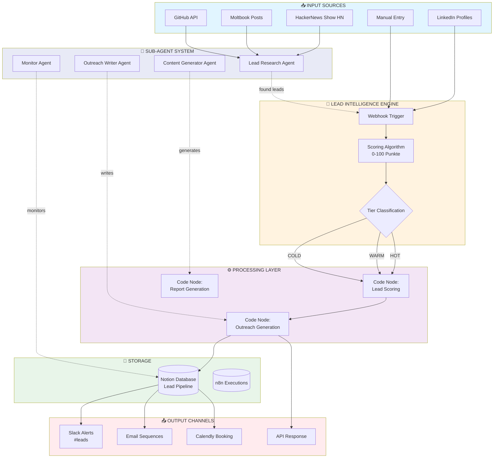
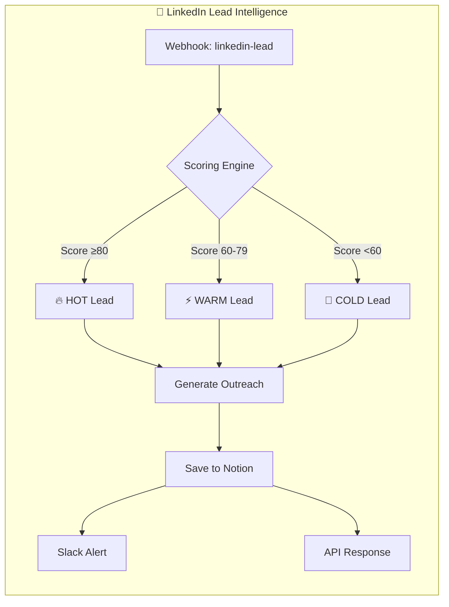
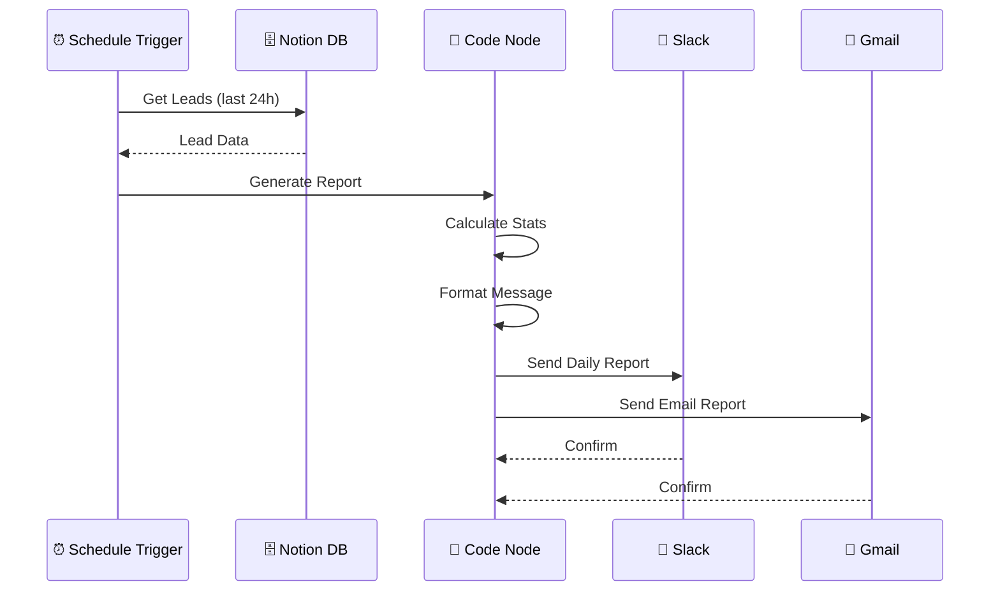
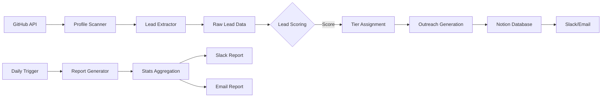

# 🎯 Navii Automation System Architecture



---

## 📊 Detailed Component View



---

## 🔄 Daily Operations Flow



---

## 🏗️ System Layers

| Layer | Komponenten | Funktion |
|-------|-------------|----------|
| **Input** | LinkedIn, HN, Moltbook, GitHub | Lead Discovery |
| **Orchestration** | n8n Workflows | Prozess-Steuerung |
| **Intelligence** | Scoring Algorithm | Lead Qualifizierung |
| **Processing** | Code Nodes, Subagenten | Daten-Verarbeitung |
| **Storage** | Notion, n8n DB | Persistenz |
| **Output** | Slack, Email, Calendly | Kommunikation |

---

## 🎯 Lead Journey

```
┌─────────────┐     ┌─────────────┐     ┌─────────────┐
│   DISCOVER  │────▶│    SCORE    │────▶│   SEGMENT   │
│             │     │             │     │             │
│ • LinkedIn  │     │ 0-100 Pts   │     │ 🔥 HOT      │
│ • HackerNews│     │             │     │ ⚡ WARM      │
│ • GitHub    │     │ Criteria:   │     │ 🧊 COLD      │
│ • Moltbook  │     │ • Title     │     │             │
│             │     │ • Industry  │     │             │
└─────────────┘     │ • Signals   │     └─────────────┘
                    └─────────────┘            │
                                               ▼
                    ┌─────────────┐     ┌─────────────┐
                    │   CONVERT   │◀────│   ENGAGE    │
                    │             │     │             │
                    │ • Meeting   │     │ • Outreach  │
                    │ • Proposal  │     │ • Follow-up │
                    │ • Close     │     │ • Nurture   │
                    └─────────────┘     └─────────────┘
```

---

## 🤖 Sub-Agent Network

```
                    ┌─────────────────┐
                    │  MAIN AGENT     │
                    │    (Navii)      │
                    └────────┬────────┘
                             │
        ┌────────────────────┼────────────────────┐
        │                    │                    │
        ▼                    ▼                    ▼
┌───────────────┐   ┌───────────────┐   ┌───────────────┐
│ LEAD RESEARCH │   │   CONTENT     │   │   MONITOR     │
│    AGENT      │   │   GENERATOR   │   │    AGENT      │
│               │   │               │   │               │
│ • GitHub API  │   │ • LinkedIn    │   │ • Web Checks  │
│ • HN Search   │   │ • Blog Posts  │   │ • Alerts      │
│ • Profile Sc. │   │ • Templates   │   │ • Reports     │
└───────┬───────┘   └───────┬───────┘   └───────┬───────┘
        │                    │                    │
        └────────────────────┼────────────────────┘
                             │
                             ▼
                    ┌─────────────────┐
                    │  SHARED MEMORY  │
                    │  (Notion/DB)    │
                    └─────────────────┘
```

---

## 📈 Data Flow Diagram



---

## 🎨 Visual Overview (ASCII)

```
┌─────────────────────────────────────────────────────────────────┐
│                    NAVII AUTOMATION SYSTEM                       │
├─────────────────────────────────────────────────────────────────┤
│                                                                 │
│  INPUTS                    CORE ENGINE              OUTPUTS     │
│  ───────                   ──────────              ───────     │
│                                                                 │
│  ┌────────┐               ┌──────────┐           ┌────────┐   │
│  │LinkedIn│──────────────▶│  WEBHOOK │──────────▶│ Notion │   │
│  └────────┘               └──────────┘           └────────┘   │
│       │                         │                     │        │
│       │                   ┌─────▼─────┐              │        │
│       │                   │SCORING    │              ▼        │
│       │                   │ENGINE     │          ┌────────┐   │
│       │                   └─────┬─────┘          │ Slack  │   │
│       │                         │               └────────┘   │
│  ┌────────┐               ┌─────▼─────┐              │        │
│  │GitHub  │──────────────▶│   CODE    │──────────▶│ Gmail  │   │
│  └────────┘               │   NODE    │           └────────┘   │
│       │                   └───────────┘                        │
│       │                          │                             │
│  ┌────────┐               ┌─────▼─────┐                       │
│  │Hacker  │──────────────▶│ SUBAGENT  │                       │
│  │News    │               │ SYSTEM    │                       │
│  └────────┘               └───────────┘                       │
│                                                                │
└─────────────────────────────────────────────────────────────────┘
```

---

*Letzte Aktualisierung: 2026-02-19*
